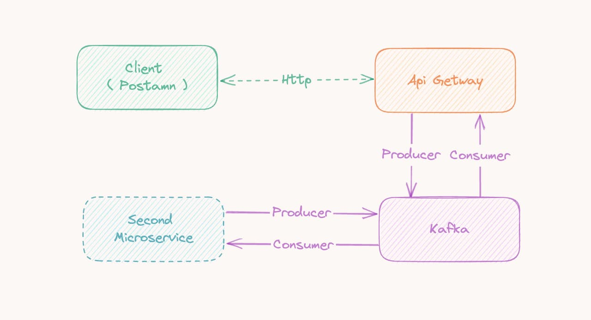

# Golang Kafka Docker Microservices Simple Example

This repository demonstrates a simple microservices architecture using Kafka, Golang, and Docker. The primary goal is to illustrate a basic setup necessary for inter-service communication through Kafka messaging queue.

## Overview

In this example:

- A client sends an HTTP request to the first microservice (API Gateway) using a tool like Postman.
- The API Gateway forwards the request to Kafka, which is then picked up by the second microservice.
- The second microservice processes the request and sends the response back to Kafka.
- The API Gateway retrieves the response from Kafka and sends it back to the client.

> Note: It's essential to have a mechanism for correlating requests and responses to ensure that each response is sent back to the correct client, especially when handling multiple concurrent requests.




## Getting Started

### Prerequisites

- Docker and Docker-Compose


### Running the Project

1. Clone the repository to your local machine:

```sh
git clone git@github.com:nikkhvat/kafka-golang-example.git
cd kafka-golang-example
```

2. Build the Docker containers:

```sh
docker-compose build
```

3. Start the services:

```sh
docker-compose up
```

Now, the API Gateway service is running on http://localhost:8080, and you can send an HTTP GET request to /ping endpoint to trigger the communication between the microservices.